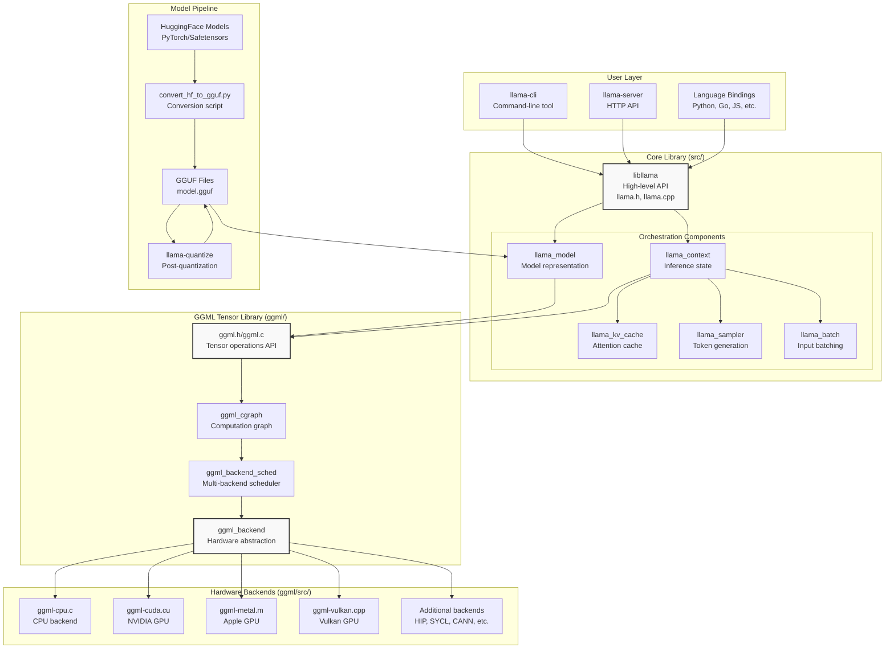
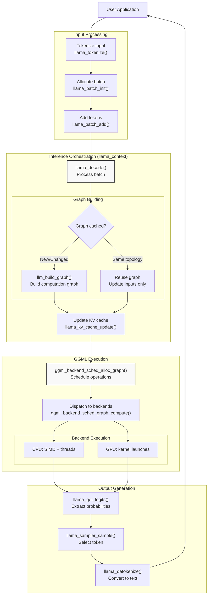
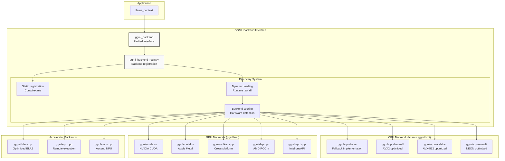
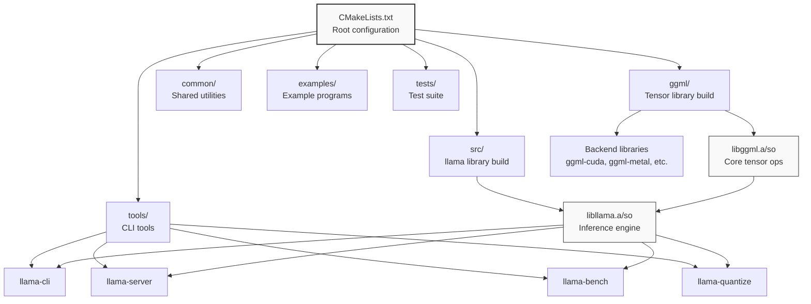

# Page: Overview

# Overview

<details>
<summary>Relevant source files</summary>

The following files were used as context for generating this wiki page:

- [.gitignore](.gitignore)
- [CMakeLists.txt](CMakeLists.txt)
- [Makefile](Makefile)
- [README.md](README.md)
- [examples/CMakeLists.txt](examples/CMakeLists.txt)

</details>


This document provides a comprehensive introduction to llama.cpp, its purpose, key features, and high-level architecture. It explains what llama.cpp is, how it fits into the LLM ecosystem, and how its major components work together. For specific subsystem details, refer to the dedicated wiki pages for each component.

## What is llama.cpp?

llama.cpp is a C/C++ implementation for Large Language Model (LLM) inference designed to enable state-of-the-art performance with minimal setup across a wide range of hardware platforms. It prioritizes:

- **Minimal dependencies**: Plain C/C++ implementation without external dependencies
- **Hardware flexibility**: Runs efficiently on CPUs, GPUs, NPUs, and accelerators
- **Local execution**: Enables on-device inference without cloud dependencies
- **Portability**: Supports desktop, mobile, embedded, and cloud environments

llama.cpp serves as the primary development playground for the [ggml](https://github.com/ggml-org/ggml) tensor library and provides production-ready tools for model deployment.

**Sources:** [README.md:11-70]()

## Key Features

llama.cpp distinguishes itself through several technical capabilities:

| Feature Category | Capabilities |
|-----------------|--------------|
| **Quantization** | 1.5-bit, 2-bit, 3-bit, 4-bit, 5-bit, 6-bit, 8-bit integer quantization for reduced memory footprint |
| **CPU Optimization** | AVX, AVX2, AVX512, AMX (x86); ARM NEON, SVE (ARM); RVV support (RISC-V) |
| **GPU Support** | CUDA (NVIDIA), Metal (Apple), HIP (AMD), Vulkan (cross-platform), SYCL (Intel), MUSA (Moore Threads) |
| **Hybrid Inference** | CPU+GPU execution for models exceeding VRAM capacity |
| **Format** | GGUF file format for standardized model storage and metadata |
| **API Compatibility** | OpenAI-compatible HTTP server for drop-in replacement |
| **Model Coverage** | 100+ model architectures including LLaMA, Mistral, Phi, Qwen, multimodal models |

**Sources:** [README.md:58-69](), [README.md:268-285]()

## Architecture Overview



**High-Level Architecture Diagram**: This diagram shows how user interfaces interact with the core library (`libllama`), which orchestrates inference through key components (`llama_context`, `llama_model`, `llama_kv_cache`). The GGML tensor library provides hardware abstraction through the backend system, while the model pipeline shows the flow from HuggingFace models to deployable GGUF files.

**Sources:** [README.md:1-90](), [CMakeLists.txt:1-279]()

## Core Components

### libllama - The Inference Engine

The `libllama` library is the primary inference engine that provides the high-level API for model loading, context management, and text generation. Key structures include:

- **`llama_model`**: Represents a loaded model with weights, architecture metadata, and vocabulary
- **`llama_context`**: Manages inference state, KV cache, and computation graph execution
- **`llama_batch`**: Handles input token batching for efficient processing
- **`llama_sampler`**: Controls token selection strategies (temperature, top-k, top-p, etc.)

For detailed information about these components, see [Core Library Architecture](#3).

**Sources:** [README.md:11-11]()

### GGML - The Tensor Library

GGML (Georgi Gerganov Machine Learning) is the computational foundation that provides:

- **`ggml_tensor`**: Core data structure for multi-dimensional arrays
- **`ggml_cgraph`**: Directed acyclic graph representing computations
- **`ggml_backend`**: Hardware abstraction interface
- **`ggml_backend_sched`**: Multi-device scheduler for hybrid inference

GGML is maintained as a separate library at [github.com/ggml-org/ggml](https://github.com/ggml-org/ggml) and synchronized into llama.cpp. See [GGML Tensor Library](#3.1) for details.

**Sources:** [README.md:70-70]()

## Repository Structure

```mermaid
graph TB
    ROOT["llama.cpp/"]
    
    ROOT --> SRC["src/<br/>Core library source"]
    ROOT --> GGML["ggml/<br/>Tensor library"]
    ROOT --> INCLUDE["include/<br/>Public headers"]
    ROOT --> TOOLS["tools/<br/>CLI tools"]
    ROOT --> EXAMPLES["examples/<br/>Example programs"]
    ROOT --> COMMON["common/<br/>Shared utilities"]
    ROOT --> TESTS["tests/<br/>Test suite"]
    ROOT --> CONVERT["convert_hf_to_gguf.py<br/>Model conversion"]
    
    SRC --> LLAMA_CPP["llama.cpp<br/>Main implementation"]
    SRC --> LLAMA_VOCAB["llama-vocab.cpp<br/>Tokenizer"]
    SRC --> LLAMA_SAMPLING["llama-sampling.cpp<br/>Sampling logic"]
    SRC --> LLAMA_GRAMMAR["llama-grammar.cpp<br/>Constrained generation"]
    
    INCLUDE --> LLAMA_H["llama.h<br/>C API"]
    INCLUDE --> LLAMA_CPP_H["llama-cpp.h<br/>C++ API"]
    
    TOOLS --> LLAMA_CLI["llama-cli/<br/>main.cpp"]
    TOOLS --> LLAMA_SERVER["llama-server/<br/>server.cpp"]
    TOOLS --> LLAMA_BENCH["llama-bench/<br/>bench.cpp"]
    TOOLS --> LLAMA_QUANTIZE["llama-quantize/<br/>quantize.cpp"]
    
    GGML --> GGML_SRC["src/<br/>Backend implementations"]
    GGML --> GGML_INCLUDE["include/<br/>GGML headers"]
    
    GGML_SRC --> GGML_C["ggml.c<br/>Core operations"]
    GGML_SRC --> GGML_CPU["ggml-cpu.c<br/>CPU backend"]
    GGML_SRC --> GGML_CUDA["ggml-cuda.cu<br/>CUDA backend"]
    GGML_SRC --> GGML_METAL["ggml-metal.m<br/>Metal backend"]
    
    style ROOT fill:#f9f9f9,stroke:#333,stroke-width:2px
    style SRC fill:#f9f9f9,stroke:#333,stroke-width:1px
    style GGML fill:#f9f9f9,stroke:#333,stroke-width:1px
    style TOOLS fill:#f9f9f9,stroke:#333,stroke-width:1px
```



**Repository Structure Diagram**: Shows the organization of source code, with the core library in `src/`, GGML tensor operations in `ggml/`, user-facing tools in `tools/`, and supporting infrastructure.

**Sources:** [CMakeLists.txt:191-221](), [examples/CMakeLists.txt:1-45]()

## Model Lifecycle

The path from a pre-trained model to inference-ready deployment involves several stages:

```mermaid
graph LR
    subgraph "Source Models"
        HF["HuggingFace Hub<br/>safetensors, config.json"]
        LOCAL["Local PyTorch<br/>model files"]
    end
    
    subgraph "Conversion (convert_hf_to_gguf.py)"
        LOAD["Load tensors<br/>Extract weights"]
        MAP["Tensor name mapping<br/>HF → GGUF standard"]
        VOCAB["Tokenizer conversion<br/>SPM/BPE/WPM"]
        META["Extract metadata<br/>Architecture params"]
        WRITE["GGUFWriter<br/>Serialize binary"]
    end
    
    subgraph "GGUF File"
        HEADER["Header: magic + version"]
        KV["KV Metadata: arch info"]
        TENSOR_INFO["Tensor info: shapes, types"]
        TENSOR_DATA["Tensor data: weights"]
    end
    
    subgraph "Optional Quantization"
        QUANT["llama-quantize<br/>Q4_0, Q4_K_M, Q8_0"]
    end
    
    subgraph "Runtime Loading"
        LOADER["llama_model_loader<br/>Parse GGUF"]
        MODEL_STRUCT["llama_model<br/>In-memory structure"]
    end
    
    HF --> LOAD
    LOCAL --> LOAD
    LOAD --> MAP
    MAP --> VOCAB
    VOCAB --> META
    META --> WRITE
    
    WRITE --> HEADER
    HEADER --> KV
    KV --> TENSOR_INFO
    TENSOR_INFO --> TENSOR_DATA
    
    TENSOR_DATA --> QUANT
    QUANT --> LOADER
    TENSOR_DATA --> LOADER
    
    LOADER --> MODEL_STRUCT
    
    style WRITE fill:#f9f9f9,stroke:#333,stroke-width:1px
    style QUANT fill:#f9f9f9,stroke:#333,stroke-width:1px
    style LOADER fill:#f9f9f9,stroke:#333,stroke-width:1px
```



**Model Lifecycle Diagram**: Illustrates the conversion pipeline from HuggingFace format through GGUF standardization to runtime loading.

### Conversion Process

The `convert_hf_to_gguf.py` script transforms models from HuggingFace format (PyTorch/Safetensors) to GGUF:

1. **Load**: Reads model tensors and configuration from HuggingFace files
2. **Map**: Converts tensor names to GGUF standard naming conventions
3. **Tokenizer**: Converts SentencePiece/BPE/WordPiece vocabularies
4. **Metadata**: Extracts architecture hyperparameters (layers, heads, dimensions)
5. **Serialize**: Writes GGUF binary format with header, metadata, and weights

For details, see [Model Conversion Pipeline](#6.2).

### Quantization

Post-conversion quantization with `llama-quantize` reduces model size and increases inference speed:

- **Q4_0**: 4-bit quantization, smallest size
- **Q4_K_M**: 4-bit with improved quality
- **Q5_K_M**: 5-bit balanced quality/size
- **Q8_0**: 8-bit high quality

For quantization details, see [Quantization Techniques](#6.3).

**Sources:** [README.md:287-313](), [README.md:304-305]()

## Inference Execution Flow



**Inference Execution Flow Diagram**: Shows the complete path from input text through tokenization, batching, graph execution, and output generation.

### Key Optimization: Graph Reuse

A critical performance optimization in llama.cpp is computation graph caching. When the batch topology (number of tokens, sequence structure) remains unchanged between iterations, the expensive graph construction is skipped and only input tensors are updated. This significantly reduces overhead for interactive chat and streaming scenarios.

**Sources:** Based on high-level system diagrams provided

## Backend Architecture



**Backend Architecture Diagram**: Illustrates the plugin system that allows dynamic loading of hardware-specific implementations with automatic selection of the best available variant.

### Backend Selection Process

At initialization, llama.cpp:

1. **Discovers backends**: Searches for compiled-in and dynamically loadable backends
2. **Scores backends**: Evaluates hardware capabilities (SIMD extensions, GPU availability)
3. **Selects optimal variant**: Chooses the highest-scoring backend per device type
4. **Creates scheduler**: `ggml_backend_sched` distributes operations across selected backends

For CPU, this means automatically using AVX-512 on capable processors, falling back to AVX2, then SSE4.2, then baseline implementation.

For details on individual backends, see [Backend System](#4).

**Sources:** [README.md:268-285]()

## User Interfaces and Tools

llama.cpp provides multiple interfaces for different use cases:

| Tool | Purpose | Primary Use Case |
|------|---------|-----------------|
| `llama-cli` | Interactive command-line interface | Experimentation, testing, conversation mode |
| `llama-server` | HTTP API server | Production deployment, OpenAI API compatibility |
| `llama-run` | Simple runner with Ollama integration | Quick model execution |
| `llama-bench` | Performance benchmarking | Hardware evaluation, optimization |
| `llama-quantize` | Model quantization | Model size reduction |
| `llama-perplexity` | Quality metrics | Model evaluation |

### Example Usage

```bash
# Interactive conversation
llama-cli -m model.gguf

# Launch OpenAI-compatible API server
llama-server -m model.gguf --port 8080

# Benchmark model performance
llama-bench -m model.gguf

# Quantize model to 4-bit
llama-quantize model.gguf model-q4_0.gguf Q4_0
```

For detailed documentation, see [User Interfaces](#5) and [Command-Line Tools](#5.1).

**Sources:** [README.md:315-525]()

## Build System

llama.cpp uses CMake for cross-platform builds with extensive configuration options:

### Key Build Options

| Option | Purpose | Default |
|--------|---------|---------|
| `GGML_CUDA` | Enable CUDA backend | OFF |
| `GGML_METAL` | Enable Metal backend | ON (macOS) |
| `GGML_VULKAN` | Enable Vulkan backend | OFF |
| `LLAMA_BUILD_SERVER` | Build llama-server | ON |
| `LLAMA_BUILD_TOOLS` | Build CLI tools | ON |
| `LLAMA_CURL` | Enable model downloading | ON |

### Build Structure



**Build System Diagram**: Shows CMake build hierarchy from root configuration through library compilation to final executables.

For build instructions and advanced configuration, see [Build System and Configuration](#8.1).

**Sources:** [CMakeLists.txt:1-279](), [Makefile:1-10]()

## Supported Model Architectures

llama.cpp supports 100+ model architectures across two categories:

### Text-Only Models

- **LLaMA family**: LLaMA, LLaMA 2, LLaMA 3
- **Mistral family**: Mistral, Mixtral MoE, Codestral
- **Phi models**: Phi-1, Phi-2, Phi-3, PhiMoE
- **Qwen models**: Qwen, Qwen2, CodeQwen
- **Other architectures**: GPT-2, BERT, Falcon, Mamba, RWKV, and many more

### Multimodal Models

- **LLaVA**: Vision-language models (1.5, 1.6)
- **MiniCPM**: Efficient multimodal models
- **Qwen2-VL**: Qwen vision-language variants
- **Other**: BakLLaVA, Obsidian, Yi-VL, Moondream, Bunny

For adding new model support, see the [model addition guide](https://github.com/ggml-org/llama.cpp/blob/master/docs/development/HOWTO-add-model.md).

**Sources:** [README.md:72-158]()

## Language Bindings and Ecosystem

llama.cpp integrates with numerous programming languages and platforms:

### Official Bindings

- **Python**: `llama-cpp-python` (most popular)
- **Go**: `go-llama.cpp`
- **Node.js**: `node-llama-cpp`
- **Rust**: Multiple implementations with varying feature sets
- **C#/.NET**: `LLamaSharp`
- **Java**: `java-llama.cpp`

### UI Frameworks

Many applications build on llama.cpp, including:

- **ollama**: Model management and serving
- **LM Studio**: Desktop GUI application
- **Jan**: Cross-platform AI assistant
- **koboldcpp**: Creative writing interface
- **text-generation-webui**: Web-based interface

For a complete list, see [README.md:162-265]().

**Sources:** [README.md:162-265]()

## Getting Started

The fastest way to begin using llama.cpp:

1. **Install**: Download pre-built binaries or build from source
2. **Get a model**: Download from HuggingFace or convert your own
3. **Run inference**: Use `llama-cli` or `llama-server`

```bash
# Quick start example
llama-cli -hf ggml-org/gemma-3-1b-it-GGUF

# Launch API server
llama-server -hf ggml-org/gemma-3-1b-it-GGUF --port 8080
```

For detailed instructions, see [Getting Started](#2), [Installation](#2.1), and [Basic Usage](#2.2).

**Sources:** [README.md:32-54]()

## Documentation Structure

This wiki is organized into the following major sections:

- **[Getting Started](#2)**: Installation, basic usage, configuration
- **[Core Library Architecture](#3)**: Internal components and data structures
- **[Backend System](#4)**: Hardware acceleration and optimization
- **[User Interfaces](#5)**: Command-line tools, HTTP server, bindings
- **[Model Management](#6)**: GGUF format, conversion, quantization
- **[Advanced Features](#7)**: Multimodal, speculative decoding, constrained output
- **[Development](#8)**: Build system, testing, CI/CD, contributing

Each section provides detailed technical documentation for its respective subsystem.
