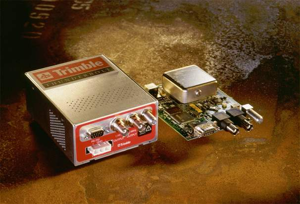

# Trimble Palisade and Thunderbolt Receivers  Last update: 21-Oct-2010 23:44 UTC    * * *

## 

## 

## Synopsis

Address:

**127.127.29. _u_**

Reference ID:

**GPS**

Driver ID:

**GPS\_PALISADE**

Serial Port:

**/dev/palisade _u_**

Serial I/O:

**9600 baud, 8-bits, 1-stop, odd parity**

Serial I/O (Thunderbolt):

**9600 baud, 8-bits, 1-stop, no parity**

## Description

 The **refclock\_palisade** driver supports [Trimble Navigation's Palisade Smart Antenna GPS receiver](http://www.trimble.com/products/ntp).

 Additional software and information about the Palisade GPS is available from: [http://www.trimble.com/oem/ntp](http://www.trimble.com/oem/ntp).

 Latest NTP driver source, executables and documentation is maintained at: [ftp://ftp.trimble.com/pub/ntp](ftp://ftp.trimble.com/pub/ntp)

This documentation describes version 7.12 of the GPS Firmware and version 2.46 (July 15, 1999) and later, of the driver source.

This documentation describes version 1 of the Thunderbolt Receiver Firmware, no tests have been made on further firmwares, please read "Notes on the Thunderbolt Receiver's Firmware" at the end of this documentation for more information.

## Operating System Compatibility

 The Palisade driver has been tested on the following software and hardware platforms:

PlatformOperating SystemNTP SourcesAccuracyi386 (PC) LinuxNTP Distribution10 usi386 (PC) Windows NT[ftp://ftp.trimble.com/pub/ntp](ftp://ftp.trimble.com/pub/ntp)1 msSUNSolaris 2.xNTP Distribution50 usHewlett-PackardHPUX 9, 10, 11[http://us-support.external.hp.com](http://us-support.external.hp.com)50 usVariousFree BSDNTP Distribution20 us

**Attention**: Thunderbolt Receiver has not being tested on the previous software and hardware plataforms.


## GPS Receiver

 The Palisade GPS receiver is an 8-channel smart antenna, housing the GPS receiver, antenna and interface in a single unit, and is designed for rooftop deployment in static timing applications.


Palisade generates a PPS synchronized to UTC within +/- 100 ns.  The Palisade's external event input with 40 nanosecond resolution is utilized by the Palisade NTP driver for asynchronous precision time transfer.

No user initialization of the receiver is required. This driver is compatible with the following versions of Palisade:

 Version
 Event Input
 Trimble Part Number
 7.02
 No
 26664-00
 7.02E
 Yes
 26664-10
 7.12
 Yes
 38158-00
 Note: When using Palisade 26664-00, you must set fudge flag2 to 1 in **ntp.conf**. See [configuration](#Configuration).


### GPS Installation

 A location with unobstructed view of the horizon is recommended. Palisade is designed to be securely mounted atop standard 3/4 inch threaded pipe.


The 12 conductor (dia. 10 mm)  power and I/O cable must be routed from the rooftop site to the NTP server and properly strain relieved.

### GPS Connection

 The Palisade is equipped with dual (A & B) RS-422 serial interfaces and a differential TTL PPS output. An RS-232 / RS-422 Interface Module is supplied with the Palisade NTP Synchronization Kit. Palisade [port A](#PortA) must be connected to the NTP host server. Maximum antenna cable length is 500 meters. See the [pinouts](#Pinouts) table for detailed connection Information.


Palisade's [port B](#PortB) provides a TSIP (Trimble Standard Interface Protocol) interface for diagnostics, configuration, and monitoring. Port B and the PPS output are not currently used by the Palisade NTP reference clock driver.

## O/S Serial Port Configuration

 The driver attempts to open the device **[/dev/palisade _u_](#REFID)** where **_u_** is the NTP refclock unit number as defined by the LSB of the refclock address.  Valid refclock unit numbers are 0 - 3.


The user is expected to provide a symbolic link to an available serial port device.  This is typically performed by a command such as:

> ln -s /dev/ttyS0 /dev/palisade0

 Windows NT does not support symbolic links to device files. COM **x**: is used by the driver, based on the refclock unit number, where unit 1 corresponds to COM **1**: and unit 3 corresponds to COM3:

## NTP Configuration

 Palisade NTP configuration file **"ntp.conf"** with event polling:

#------------------------------------------------------------------------------

\# The Primary reference

server 127.127.29.0 # Trimble Palisade GPS Refclock Unit #0

peer terrapin.csc.ncsu.edu # internet server

\# Drift file for expedient re-synchronization after downtime or reboot.

driftfile /etc/ntp.drift

#------------------------------------------------------------------------------

Configuration without event polling:

#------------------------------------------------------------------------------

\# The Primary reference

server 127.127.29.0 # Trimble Palisade GPS (Stratum 1).

\# Set packet delay

[fudge 127.127.29.0 time1 0.020](#time1)

\# and set flag2 to turn off event polling.

[fudge 127.127.29.0 flag2 1](#flag2)

#------------------------------------------------------------------------------

#### Thunderbolt NTP Configuration file

#------------------------------------------------------------------------------

Configuration without event polling:

#------------------------------------------------------------------------------

\# The Primary reference

server 127.127.29.0 mode 2 # Trimble Thunderbolt GPS (Stratum 1).

\# Set packet delay

[fudge 127.127.29.0 time1 0.020](#time1)

\# and set flag2 to turn off event polling.

[fudge 127.127.29.0 flag2 1](#flag2)

#------------------------------------------------------------------------------

 Currently the Thunderbolt mode doesn't support event polling, the reasons are explained on the "Notes on the Thunderbolt Receiver's Firmware" section at the end of this documentation.


## Time Transfer and Polling

 Time transfer to the NTP host is performed via the Palisade's comprehensive time packet output. The time packets are output once per second, and whenever an event timestamp is requested.


The driver requests an event time stamp at the end of each polling interval, by pulsing the RTS (request to send) line on the serial port. The Palisade GPS responds with a time stamped event packet.

Time stamps are reported by the Palisade with respect to UTC time. The GPS receiver must download UTC offset information from GPS satellites. After an initial UTC download, the receiver will always start with correct UTC offset information.

## Run NTP in Debugging Mode

 The following procedure is recommended for installing and testing a Palisade NTP driver:


1. Perform initial checkout procedures. Place the GPS receiver outdoors; with clear view of the sky. Allow the receiver to obtain an UTC almanac.

2. Verify presence of timing packets by observing the 1 Hz (PPS) led on the interface module. It should flash once per second.

3. Connect Palisade's port A to the NTP host.

4. Configure NTP and the serial I/O port on the host system.

5. Initially use[fudge flag2](#flag2) in **[ntp.conf](#Configuration),** to disable event polling (see configuration).

6. Run NTP in debug mode (-d -d), to observe Palisade\_receive events.

7. The driver reports the[tracking status of the receiver](#TrackingStatus). Make sure it is tracking several satellites.

8. Remove fudge flag2 and restart**ntpd** in debug mode to observe palisade\_receive events.

9. If event polling fails, verify the[connections](#Pinouts) and that the host hardware supports RTS control.


## Event Logging

 System and Event log entries are generated by NTP to report significant system events. Administrators should monitor the system log to observe NTP error messages. Log entries generated by the Palisade NTP reference clock driver will be of the form:


> ```
> Nov 14 16:16:21 terrapin ntpd[1127]: Palisade #0: <i>message</i>
> ```

## Fudge Factors

[time1 _time_](#Configuration)Specifies the time offset calibration factor, in seconds and fraction, with default 0.0. If event capture is not used, time1 should be set to 20 milliseconds to correct serial line and operating system delays incurred in capturing time stamps from the synchronous packets.
 stratum _number_Specifies the driver stratum, in decimal from 0 to 15, with default 0.
 [refid _string_](#REFID)Specifies the driver reference identifier, **GPS**.
 [flag2 0 \| 1](#Configuration)When set to 1, driver does not use hardware event capture. The synchronous packet output by the receiver at the beginning of each second is time stamped by the driver. If triggering the event pulse fails, the driver falls back to this mode automatically.


## Mode Parameter

mode _number_The mode parameter to the server command specifies the specific hardware this driver is for. The default is 0 for a normal Trimble Palisade. The other options are **1** for an **Endrun Praecis** in Trimble emulation mode, and **2** for the **Trimble Thunderbolt** GPS Disciplined Clock Receiver.


## DEFINEs

 The following constants are defined in the driver source code. These defines may be modified to improve performance or adapt to new operating systems.

**Label**DefinitionDefault ValueDEVICEThe serial port device to be used by the driver/dev/palisade **_u_**PRECISIONAccuracy of time transfer1 microsecondCURRENT\_UTCValid GPS - UTC offset13SPEED232Host RS-232 baud rateB9600TRMB\_MINPOLL Minimum polling interval5 (32 seconds)TRMB\_MAXPOLLMaximum interval between polls7 (128 seconds)

## Data Format

 Palisade port A can output two synchronous time packets. The NTP driver can use either packet for synchronization. Packets are formatted as follows:


### **Packet 8F-AD (Primary NTP Packet)**

ByteItemTypeMeaning0Sub-Packet IDBYTESubcode 0xAD1 - 2Event CountINTEGERExternal event count recorded (0 = PPS)3 - 10Fractional SecondDOUBLETime elapsed in current second (s)11HourBYTEHour (0 - 23)12MinuteBYTEMinute (0 - 59)13SecondBYTESecond (0 - 59; 60 = leap)14DayBYTEDate (1 - 31)15MonthBYTEMonth (1 - 12)16 - 17YearINTEGERYear (4 digit)18Receiver StatusBYTETracking Status19UTC FlagsBYTELeap Second Flags20ReservedBYTEContains 0xFF21ReservedBYTEContains 0xFF

> #### Leap Second Flag Definition:
>
> Bit 0:  (1) UTC Time is available
>
>  Bits 1 - 3: Undefined
>
> Bit 4:  (1) Leap Scheduled: Leap second pending asserted by GPS control segment.
>
> Bit 5:  (1) Leap Pending: set 24 hours before, until beginning of leap second.
>
> Bit 6:  (1) GPS Leap Warning: 6 hours before until 6 hours after leap event
>
> Bit 7:  (1) Leap In Progress. Only set during the leap second.
>
>
> #### Tracking Status Flag Definitions:

CodeMeaningAccuracyReceiver Mode0Receiver is Navigating\+/\- 1 usSelf Survey1Static 1 Sat. Timing Mode \+/\- 1 us1-D Timing2Approximate Time20 - 50 msAcquisition3StartupN/AInitialization4StartupN/AInitialization5Dilution of Position too High 5 ppmSelf Survey6Static 1 Sat. Timing: Sat. not usable5 ppm1-D Timing7No Satellites UsableN/ASelf Survey8Only 1 Satellite Usable20 - 50 msSelf Survey9Only 2 Satellite Usable20 - 50 msSelf Survey10Only 3 Satellites Usable20 - 50 msSelf Survey11Invalid SolutionN/AError12Differential Corrections N/AN/A13Overdetermined Fixes\+/\- 100 nsTiming Steady State

### **Packet 8F-0B (Comprehensive Timing Packet)**

ByteItemTypeMeaning0Sub-Packet IDBYTESubcode 0x0B1 - 2Event CountINTEGERExternal event count recorded (0 = PPS)3 - 10UTC / GPS TOWDOUBLEUTC / GPS time of week (seconds)11DateBYTEDay of Month12MonthBYTEMonth of Event13 - 14YearINTYear of event15Receiver ModeBYTEReceiver operating dimensions:

0: Horizontal (2D)

1: Full Position (3D)

2: Single Satellite (0D)

3: Automatic (2D / 3D)

4: DGPS reference

5: Clock hold (2D)

 6: Over determined Clock15 - 17UTC OffsetINTEGERUTC Offset value (seconds)18 - 25Oscillator BiasDOUBLEOscillator BIAS (meters)26 - 33Oscillator Drift RateDOUBLEOscillator Drift (meters / second)34 - 37Bias UncertaintySINGLEOscillator bias uncertainty (meters)38 - 41Drift UncertaintySINGLEOscillator bias rate uncertainty (m / sec)42 - 49LatitudeDOUBLELatitude in radians50 - 57LongitudeDOUBLELongitude in radians58 - 65AltitudeDOUBLEAltitude above mean sea level, in meters66 - 73Satellite IDBYTESV Id No. of tracked satellites

### Thunderbolt Timing packets Data Format

 Thunderbolt can output 2 synchronous packets.


#### **Primary Timing Packet - 0x8FAB**

 ****Byte****Bit****Item****Type****Value****Description**0SubcodeUINT80xAB1-4Time of WeekUINT32GPS seconds of week5-6Week NumberUINT16GPS Week Number7-8UTC OffsetSINT16UTC Offset (seconds)901234Timing FlagBit field0 or 10 or 10 or 10 or 10 or 1GPS Time or UTC TimeGPS PPS or UTC PPStime is set or time is not sethave UTC info or no UTC infoTime from GPS or time from user10SecondsUINT80-59(60 for UTC leap second event)11MinutesUINT80-59Minutes of Hour12HoursUINT80-23Hour of Day13Day of MonthUINT81-31Day of Month14MonthUINT81-12Month of Year15-16YearUINT16Four digits of Year (e.g. 1998)

#### **Supplemental Timing Packet - 0x8FAC**

**Byte****Bit****Item****Type****Value****Description**0SubcodeUINT80xAC1Receiver ModeUINT80123456Automatic (2D/3D)Single Satellite (Time)Horizontal (2D)Full Position (3D)DGPS ReferenceClock Hold (2D)Overdetermined Clock2Disciplining ModeUINT80123456NormalPower-UpAuto HoldoverManual HoldoverRecoveryNot UsedDisciplining disabled3Self-Survey ProgressUINT 80-100%4-7Holdover DurationUINT 32seconds8-901234Critical AlarmsUINT16Bit fieldROM checksum errorRAM check has failedPower supply failureFPGA check has failedOscillator control voltage at rail10-110123456Minor AlarmsUINT16Bit fieldNormalPower-UpAuto HoldoverManual HoldoverRecoveryNot UsedDisciplining disabled12GPS Decoding StatusUINT8013890x0A0x0B0x0C0x10Doing fixesDon t have GPS timePDOP is too highNo usable satsOnly 1 usable satOnly 2 usable satsOnly 3 usable satsThe chosen sat is unusableTRAIM rejected the fix13Disciplining ActivityUINT8012345678Phase lockingOscillator warming upFrequency lockingPlacing PPSInitializing loop filterCompensating OCXOInactiveNot usedRecovery mode14Spare Status 1UINT8015Spare Status 2UINT8016-19PPS OffsetSingleEstimate of UTC/GPS offset (ns)20-2310 MHz OffsetSingleEstimate of UTC/GPS offset (ns)24-27DAC ValueUINT32Offset binary (0x00 - 0xFFFFF)28-31DAC VoltageSingleVolts32-35TemperatureSingledegrees C36-43LatitudeDoubleradians44-51LongitudeDoubleradians52-59AltitudeDoubleMeters60-67SpareFor Future Expantion

## Pinouts

 [The following connections are required when connecting Palisade with a host:](#Connection)

Description**Host****Palisade****Port A**DB-9DB-25RS-232RS-422Palisade PinReceive Data 23<-->GreenGreen / Blue8 (T-) & 10 (T+)Request to Send74<-->GrayGray / White6 (R-) & 7 (R+)Signal Ground57<-->BlackBlack9 (GND)**Port B**Receive Data 23<-->BrownBrown / Yellow4 (T-) & 5 (T+)Transmit Data32<-->VioletOrange/ Violet2 (R-) & 3 (R+)Signal Ground57<-->BlackBlack9 (GND)

> Note: If driving the RS-422 inputs on the Palisade single ended, i.e. using the Green and Gray connections only, does not work on all serial ports. Use of the Palisade NTP Synchronization Interface Module is recommended.

> The 12 pin connector pinout definition:
>
>  Face the round 12 pin connector at the end of the cable, with the notch turned upwards.
>
>  Pin 1 is to the left of the notch. Pins 2 - 8 wrap around the bottom, counterclockwise to pin 9 on the right of the notch. Pin 10 is just below the notch. Pins 10 (top), 11 (bottom left) and 12 (bottom right) form a triangle in the center of the connector.

> Pinouts for the Palisade NTP host adapter (Trimble PN 37070) DB-25 M connector are as follows:

DB-25MConductor PalisadeDescription1 Red1Power7 Black9Ground9Black/White12PPS -10 Green8Transmit Port A (T-)11 Brown4Transmit Port B (T-)12 Gray7Receive Port A (R+)13Orange3Receive Port B (R+)21Orange/White11PPS +22Blue10Transmit Port A (T+)23Yellow5Transmit Port B (T+)24White6Receive Port A (R-)25Violet2Receive Port B (R-)

### Notes on the Thunderbolt Receiver's Firmware

 The support for Thunderbolt Receiver in the palisade driver doesn't support (for now) event-polling, the reason is that the Thunderbolt receiver the patch is written for doesn't support time-on-request, so you just have to sit there and wait for the time to arrive with the PPS. We tried to contact Trimble because there's presumably a firmware update that support it, but we didn't have much luck.
Here is a link explaining the situation:
[https://lists.ntp.isc.org/pipermail/hackers/2006-April/002216.html](https://lists.ntp.isc.org/pipermail/hackers/2006-April/002216.html)

[* * *](https://lists.ntp.isc.org/pipermail/hackers/2006-April/002216.html)
[Questions or Comments:](https://lists.ntp.isc.org/pipermail/hackers/2006-April/002216.html) [Sven Dietrich](mailto:sven_dietrich@trimble.com)

[Trimble Navigation Ltd.](http://www.trimble.com/)
 [Fernando P. Hauscarriaga](mailto:fernandoph@iar.unlp.edu.ar)

(last updated January 15, 2007)

* * *

 ;**

