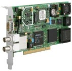

# _hopf_ PCI-Bus Receiver (6039 GPS/DCF77)

Last update:
21-Oct-2010 23:44
UTC

* * *

## Synopsis

Address:

**127.127.39. _X_**

Reference ID:

**.hopf.**(default) **, GPS, DCF**

Driver ID:

**HOPF\_P**__

* * *

## Description

 The **refclock\_hopf\_pci** driver supports the [hopf](http://www.hopf.com) PCI-bus interface 6039 GPS/DCF77.

 Additional software and information about the software drivers maybe available from: [http://www.ATLSoft.de/ntp](http://www.ATLSoft.de/ntp).

 Latest NTP driver source, executables and documentation is maintained at: [http://www.ATLSoft.de/ntp](http://www.ATLSoft.de/ntp)

* * *

## Operating System Compatibility

The hopf clock driver has been tested on the following software and hardware platforms:

**Platform**

**Operating System**

i386 (PC)

Linux

i386 (PC)

Windows NT

i386 (PC)

Windows 2000

* * *

## O/S System Configuration

**UNIX**

 The driver attempts to open the device **[/dev/hopf6039](#REFID)** . The device entry will be made by the installation process of the kernel module for the PCI-bus board. The driver sources belongs to the delivery equipment of the PCI-board.

**Windows NT/2000**

The driver attempts to open the device by calling the function "OpenHopfDevice()". This function will be installed by the Device Driver for the PCI-bus board. The driver belongs to the delivery equipment of the PCI-board.

* * *

## Fudge Factors

[**refid _string_**](#REFID)Specifies the driver reference identifier, **GPS** _or_ **DCF**.
 **flag1 0 \| 1**When set to 1, driver sync's even if only crystal driven.

* * *

### Questions or Comments:

[Bernd Altmeier](mailto:altmeier@atlsoft.de) [Ing.-Büro für Software www.ATLSoft.de](http://www.ATLSoft.de)

* * *

