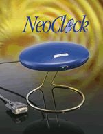

# NeoClock4X - DCF77 / TDF serial line receiver

Last update:
21-Oct-2010 23:44
UTC

* * *

## Synopsis

Adress

127.127.44.u

Reference ID

neol

Driver ID

NEOCLK4X

Serial Port

/dev/neoclock4x-u

* * *

## Description

 The refclock\_neoclock4x driver supports the NeoClock4X receiver available from [Linum Software GmbH](http://www.linum.com). The receiver is available as a [DCF77](http://www.dcf77.de) or TDF receiver. Both receivers have the same output string. For more information about the NeoClock4X receiver please visit [http://www.linux-funkuhr.de](http://www.linux-funkuhr.de).

* * *

## Fudge Factors

**[time1 time](../clockopt.html)**Specifies the time offset calibration factor with the default value off 0.16958333 seconds. This offset is used  to correct serial line and operating system delays incurred in capturing time stamps. If you want to fudge the time1 offset **ALWAYS** add a value off 0.16958333. This is neccessary to compensate to delay that is caused by transmit the timestamp at 2400 Baud. If you want to compensate the delay that the DCF77 or TDF radio signal takes to travel to your site simply add the needed millisecond delay to the given value. Note that the time here is given in seconds.
 Default setting is 0.16958333 seconds.

**[time2 time](../clockopt.html)**Not used by this driver.
 [**flag1 0 \| 1**](../clockopt.html)When set to 1 the driver will feed ntp with timestampe even if the radio signal is lost. In this case an internal backup clock generates the timestamps. This is ok as long as the receiver is synced once since the receiver is able to keep time for a long period.
 Default setting is 0 = don't synchronize to CMOS clock.
 [**flag2 0 \| 1**](../clockopt.html)You can allow the NeoClock4X driver to use the quartz clock even if it is never synchronized to a radio clock. This is usally not a good idea if you want preceise timestamps since the CMOS clock is maybe not adjusted to a dst status change. So **PLEASE** switch this only on if you now what you're doing.
 Default setting is 0 = don't synchronize to unsynchronized CMOS clock.
 [**flag3 0 \| 1**](../clockopt.html)Not used by this driver.
 [**flag4 0 \| 1**](../clockopt.html)It is recommended to allow extensive logging while you setup the NeoClock4X receiver. If you activate flag4 every received data is logged. You should turn off flag4 as soon as the clock works as expected to reduce logfile cluttering.
 Default setting is 0 = don't log received data and converted utc time.

* * *

 Please send any comments or question to [neoclock4x@linum.com](mailto:neoclock4@linum.com).

* * *

