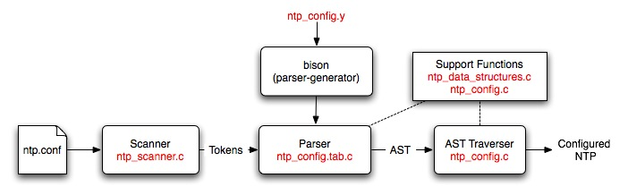

### Configuration File Definition (Advanced)

 [from _Pogo_, Walt Kelly](http://www.eecis.udel.edu/~mills/pictures.html)

Racoon is shooting configuration bugs.

Last update:
4-Oct-2010 05:13
UTC

#### Table of Contents

- [Synopsis](#synopsis)
- [Files](#files)
- [High-Level Description](#high-level)
- [Detailed Description](#detailed)
- [Guidelines for Adding Configuration Commands](#guidelines)

* * *

#### Synopsis

The NTP configuration process is driven by a phrase-structure grammar which is used to specify the format of the configuration commands and the actions needed to build an abstract syntax tree (AST). The grammar is fed to a parser generator (Bison) which produces a parser for the configuration file.

The generated parser is used to parse an NTP configuration file and check it for syntax and semantic errors. The result of the parse is an AST, which contains a representation of the various commands and options. This AST is then traversed to set up the NTP daemon to the correct configuration.

This document is intended for developers who wish to modify the configuration code and/or add configuration commands and options. It contains a description of the files used in the configuration process as well as guidelines on how to construct them.

#### Files

A brief description of the files used by the configuration code is given below:

FileDescription**ntp\_config.y**This file is a Bison source file that contains the phrase-structure grammar and the actions that need to be performed to generate an AST.**ntp\_config.c**This file contains the major chunk of the configuration code. It contains all the functions that are called for building the AST as well as the functions that are needed for traversing the AST.**ntp\_config.h**This file is the header file for **ntp\_config.c**. It mainly contains the structure definitions needed to build the AST. **ntp\_scanner.c**This file contains the code for a simple lexical analyzer. This file is directly included into the **ntp\_config.c** file since this code is only used by the configuration code. The most important function in this file is yylex, which is called by the generated parser to get the next token on the input line.**ntp\_data\_structures.c**This file contains a generic implementation of a priority queue and a simple queue. This code can be used to create a queue for any structure.**ntp\_data\_structures.h**This header file contains the structure declarations and function prototypes needed to use the data structures defined in **ntp\_data\_structures.c**. This file forms the public interface of the data structures.**ntp\_config.tab.c**This file is generated by Bison from the **ntp\_config.y** file. This file is also included directly into the configuration code.

#### High-Level Description

A high-level description of the configuration process showing where all the files fit in is given below:

The scanner reads in an NTP configuration file and converts it into tokens. The Bison generated parser reads these tokens and converts them into an AST. The AST traverser consists of a set of functions that configure parts of NTP on the basis of what is on the tree. A more detailed description of these parts and the files used is given below:

#### Detailed Description

**ntp\_scanner.c**This file contains the scanner. The scanner is a small program that converts an input NTP configuration file into a set of **tokens** that correspond to **lexemes** in the input. Lexemes are strings in the input, delimited by whitespace and/or special characters. Tokens are basically unique integers that represent these lexemes. A different token is generated for each reserved word and special character in the input. There are two main functions in the public interface of this file:int yylex()This function is called yylex for historical reasons; lex is a program that takes a set of regular expressions and generates a scanner that returns tokens corresponding to those regular expressions. The name of the generated function is called yylex. We aren't usinglexbecause it requires linking against an external library and we didn't want to increase the compile-time requirements of NTP.History lessons aside, this function basically checks to see if the next input character is a special character as defined in the array char special\_char[]. (The function int is\_special(char ch), can be used for this.) If yes, the special character is returned as the token. If not, a set of characters is read until the next whitespace or special character is encountered. This set of characters forms the lexeme; yylex then checks whether this lexeme is an integer, a double, an IP address or a reserved word. If yes, the corresponding token is returned. If not, a token for a string is returned as the default token.struct state \*create\_keyword\_scanner(struct key\_tok \* _keyword\_list_)This function takes a list of ( _keyword, token_) pairs and converts them into a trie that can recognize the keywords (reserved words). Every time the scanner reads a lexeme, it compares it against the list of reserved words. If it finds a match, it returns the corresponding token for that keyword.**ntp\_data\_structures.c**This file contains an implementation of a generic priority queue and FIFO queue. By generic, we mean that these queues can hold element of any type (integers, user-defined structs, etc.), provided that these elements are allocated on the heap using the function void \*get\_node(size\_t size). Note that the prototype for this function is exactly the same as that of malloc and that it can be used in the exact same way. Behind the scenes, get\_node calls malloc to allocate _size_ plus some extra memory needed for bookkeeping. The allocated memory can be freed using the function void free\_node (void \* _my\_node_). In addition to these two functions, the public interface of this file contains the following functions:queue \*create\_priority\_queue(int (\*get\_order)(void \*, void\*))This function creates a priority queue in which the order of the elements is determined by the get\_orderfunction that is passed as input to the priority queue. The get\_orderfunction should return positive if the priority of the first element is less than the priority of the second element.queue \*create\_queue(void)This function creates a FIFO queue. It basically calls the create\_priority\_queue function with the get\_fifo\_orderfunction as its argument.void destroy\_queue(queue \* _my\_queue_)This function deletes _my\_queue_and frees up all the memory allocated to it an its elements.int empty(queue \* _my\_queue_)This function checks to see if _my\_queue_ is empty. Returns true if _my\_queue_ does not have any elements, else it returns false.queue \*enqueue(queue \* _my\_queue_, void \* _my\_node_)This function adds an element, _my\_node_, to a queue, _my\_queue_. _my\_node_ must be allocated on the heap using the get\_node function instead of malloc.void \*dequeue(queue \* _my\_queue_)This function returns the element at the front of the queue. This element will be element with the highest priority.int get\_no\_of\_elements(queue \* _my\_queue_)This function returns the number of elements in _my\_queue_.void append\_queue(queue \* _q_ 1, queue \* _q_ 2)This function adds all the elements of _q_ 2 to _q_ 1. The queue _q_ 2 is destroyed in the process.**ntp\_config.y**This file is structured as a standard Bison file and consists of three main parts, separated by %%:

1. The prologue and bison declarations: This section contains a list of the terminal symbols, the non-terminal symbols and the types of these symbols.
2. The rules section: This section contains a description of the actual phrase-structure rules that are used to parse the configuration commands. Each rule consists of a left-hand side (LHS), a right-hand side (RHS) and an optional action. As is standard with phrase-structure grammars, the LHS consists of a single non-terminal symbol. The RHS can contain both terminal and non-terminal symbols, while the optional action can consist of any arbitrary C code.
3. The epilogue: This section is left empty on purpose. It is traditionally used to code the support functions needed to build the ASTs Since, we have moved all the support functions to**ntp\_config.c**, this section is left empty.

#### Prologue and Bison Declarations

All the terminal symbols (also known as tokens) have to be declared in the prologue section. Note that terminals and non-terminals may have values associated with them and these values have types. (More on this later). An unnamed union has to be declared with all the possible types at the start of the prologue section. For example, we declare the following union at the start of the **ntp\_config.y** file:

%union {

    char \*String;

    double Double;

    int Integer;

    void \*VoidPtr;

    queue \*Queue;

    struct attr\_val \*Attr\_val;

    struct address\_node \*Address\_node;

    struct setvar\_node \*Set\_var;

    /\\* Simulation types \*/

    server\_info \*Sim\_server;

    script\_info \*Sim\_script;

}

Some tokens may not have any types. For example, tokens that correspond to reserved words do not usually have types as they simply indicate that a reserved word has been read in the input file. Such tokens have to be declared as follows:

%token T\_Discard

%token T\_Dispersion

Other tokens do have types. For example, a T\_Double token is returned by the scanner whenever it sees a floating-point double in the configuration file. The value associated with the token is the actual number that was read in the configuration file and its type (after conversion) is double. Hence, the token T\_Double will have to be declared as follows in the prologue of **ntp\_config.y** file:

%token <Double> T\_Double

Note that the declaration given in the angled brackets is not double but Double, which is the name of the variable given in the %union {} declaration above.

Finally, non-terminal symbols may also have values associated with them, which have types. This is because Bison allows non-terminal symbols to have actions associated with them. Actions may be thought of as small functions which get executed whenever the RHS of a non-terminal is detected. The return values of these functions are the values associated with the non-terminals. The types of the non-terminals are specified with a %type declaration as shown below:

%type <Queue> address\_list

%type <Integer> boolean

The %type declaration may be omitted for non-terminals that do not return any value and do not have type information associated with them.

#### The Rules Section

The rule section only consists of phrase-structure grammar rules. Each rule typically has the following format:

LHS : RHS [{ Actions }]

    ;

where LHS consists of a single non-terminal symbol and the RHS consists of one or more terminal and non-terminal symbols. The Actions are optional and may consist of any number of arbitrary C statements. Note that Bison can only process LALR(1) grammars, which imposes additional restrictions on the kind of rules that can be specified. Examples of rules are shown below:

orphan\_mode\_command

    : T\_Tos tos\_option\_list

        { append\_queue(my\_config.orphan\_cmds, $2); }

    ;

tos\_option\_list

    : tos\_option\_list tos\_option { $$ = enqueue($1, $2); }

    \| tos\_option { $$ = enqueue\_in\_new\_queue($1); }

    ;

The $n notation, where n is an integer, is used to refer to the value of a terminal or non-terminal symbol. All terminals and non-terminal symbols within a particular rule are numbered (starting from 1) according to the order in which they appear within the RHS of a rule. $$ is used to refer to the value of the LHS terminal symbol - it is used to return a value for the non-terminal symbol specified in the LHS of the rule.

#### Invoking Bison

Bison needs to be invoked in order to convert the **ntp\_config.y** file into a C source file. To invoke Bison, simply enter the command:

bison ntp\_config.y

at the command prompt. If no errors are detected, an **ntp\_config.tab.c** file will be generated by default. This generated file can be directly included into the **ntp\_config.c** file.

If Bison report shift-reduce errors or reduce-reduce errors, it means that the grammar specified using the rules in not LALR(1). To debug such a grammar, invoke Bison with a -v switch, as shown below. This will generate a **ntp\_config.output** file, which will contain a description of the generated state machine, together with a list of states that have shift-reduce/reduce-reduce conflicts. You can then change the rules to remove such conflicts.

bison -v ntp\_config.y

For more information, refer to the [Bison manual](http://www.gnu.org/software/bison/manual/html_mono/bison.html).

**ntp\_config.c**

This file contains the major chunk of the configuration code including all the support functions needed for building and traversing the ASTs. As such, most of the functions in this file can be divided into two groups:

1. Functions that have acreate\_ prefix. These functions are used to build a node of the AST.
2. Functions that have aconfig\_ prefix. These functions are used to traverse the AST and configure NTP according to the nodes present on the tree.

#### Guidelines for Adding Configuration Commands

The following steps may be used to add a new configuration command to the NTP reference implementation:

1. Write phrase-structure grammar rules for the syntax of the new command. Add these rules to the rules section of the**ntp\_config.y** file.
2. Write the action to be performed on recognizing the rules. These actions will be used to build the AST.
3. If new reserved words are needed, add these to thestruct key\_tok keyword\_list[]structure in the **ntp\_config.c** file. This will allow the scanner to recognize these reserved words and generate the desired tokens on recognizing them.
4. Specify the types of all the terminals and non-terminal symbols in the prologue section of the**ntp\_config.c** file.
5. Write a function with aconfig\_ prefix that will be executed for this new command. Make sure this function is called in the config\_ntpd()function.

* * *

[Sachin Kamboj](mailto:skamboj@udel.edu)

