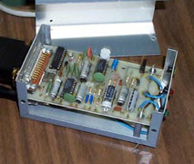

### Pulse-Per-Second (PPS) Signal Interfacing

 [from _Alice's Adventures in Wonderland_, Lewis Carroll](http://www.eecis.udel.edu/%7emills/pictures.html)

Alice is trying to find the PPS signal connector.

Last update:
10-Mar-2014 05:17
UTC

#### Related Links

#### Table of Contents

- [Introduction](#intro)
- [Gadget Box](#gadget)
- [Operating System Support](#opsys)
- [Using the Pulse-per-Second (PPS) Signal](#use)

* * *

#### Introduction

Most radio clocks are connected using a serial port operating at speeds of 9600 bps. The accuracy using typical timecode formats, where the on-time epoch is indicated by a designated ASCII character such as carriage-return <cr>, is normally limited to 100 μs. Using carefully crafted averaging techniques, the NTP algorithms can whittle this down to a few tens of microseconds. However, some radios produce a pulse-per-second (PPS) signal which can be used to improve the accuracy to a few microseconds. This page describes the hardware and software necessary for NTP to use the PPS signal.

The PPS signal can be connected in either of two ways. On FreeBSD systems (with the PPS\_SYNC and pps kernel options) it can be connected directly to the ACK pin of a parallel port. This is the preferred way, as it requires no additional hardware. Alternatively, it can be connected via the DCD pin of a serial port. However, the PPS signal levels are usually incompatible with the serial port interface signals. Note that NTP no longer supports connection via the RD pin of a serial port.

A Gadget Box built by Chuck Hanavin

#### Gadget Box

The gadget box shown above is assembled in a 5"x3"x2" aluminum minibox containing the the circuitry, serial connector and optional 12-V power connector. A complete set of schematics, PCB artwork, drill templates can be obtained via the web from ftp.udel.edu as [gadget.tar.Z](ftp://ftp.udel.edu/pub/ntp/hardware/gadget.tar.Z).

The gadget box includes two subcircuits. One of these converts a TTL positive edge into a fixed-width pulse at EIA levels and is for use with a timecode receiver or precision oscillator with a TTL PPS output. The other converts the timecode modulation broadcast by Canadian time/frequency standard station CHU into a 300-bps serial character stream at EIA levels and is for use with the [Radio CHU Audio Demodulator/Decoder](drivers/driver7.html) driver.

#### Operating System Support

Both the serial and parallel port connection require operating system support, which is available in a few operating systems, including FreeBSD, Linux (with PPSkit patch) and Solaris. Support on an experimental basis is available for several other systems, including SunOS and HP/Compaq/Digital Tru64. The kernel interface described on the [PPSAPI Interface for Precision Time Signals](kernpps.html) page is the only interface currently supported. Older PPS interfaces based on the ppsclock and tty\_clk streams modules are no longer supported. The interface consists of the timepps.h header file which is specific to each system. It is included automatically when the distribution is built.

#### PPS Driver

PPS support requires is built into some drivers, in particular the WWVB and NMEA drivers, and may be added to other drivers in future. Alternatively, the PPS driver described on the [Type 22 PPS Clock Discipline](drivers/driver22.html) page can be used. It operates in conjunction with another source that provides seconds numbering. The selected source is designate a prefer peer, as using the prefer option, as described on the [Mitigation Rules and the prefer Keyword](prefer.html) page. The prefer peer is ordinarily the radio clock that provides the PPS signal, but in principle another radio clock or even a remote Internet server could be designated preferred Note that the pps configuration command has been obsoleted by this driver.

#### Using the Pulse-per-Second (PPS) Signal

The PPS signal can be used in either of two ways, one using the NTP grooming and mitigation algorithms and the other using the kernel PPS signal support described in the [Kernel Model for Precision Timekeeping](kern.html) page. The presence of  kernel support is automatically detected during the NTP build process and supporting code automatically compiled. In either case, the PPS signal must be present and within nominal jitter and wander tolerances. In addition, the prefer peer must be a truechimer; that is, survive the sanity checks and intersection algorithm. Finally, the offset of the system clock relative to the prefer peer must be within ±0.5 s. The kernel maintains a watchdog timer for the PPS signal; if the signal has not been heard or is out of tolerance for more than some interval, currently two minutes, the kernel discipline is disabled and operation continues as if it were not present.

An option flag in the driver determines whether the NTP algorithms or kernel support is enabled (if available). For historical reasons, the NTP algorithms are selected by by default, since performance is generally better using older, slower systems. However, performance is generally better with kernl support using newer, faster systems.

* * *

