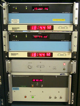

### Reference Clock Support

Master Time Facility at the [UDel Internet Research Laboratory](http://www.eecis.udel.edu/%7emills/lab.html)

Last update:
10-Mar-2014 05:20
UTC

#### Related Links

#### Table of Contents

- [Introduction](#intro)
- [Special Considerations](#spec)
- [List of Reference Clock Drivers](#list)

* * *

#### Introduction

NTP Version 4 supports almost four dozen satellite, radio and telephone modem reference clocks plus several audio devices for instrumentation signals. A general description of the reference clock support is on this page. Additional information about each reference clock driver can be found via links from this page. Additional information is on the [Debugging Hints for Reference Clock Drivers](rdebug.html) and [How To Write a Reference Clock Driver](howto.html) pages. Information on how to support pulse-per-second (PPS) signals produced by some devices is on the [Pulse-per-second (PPS) Signal Interfacing](pps.html) page. All reference clock drivers require that the reference clock use only Coordinated Universal Time (UTC). Timezone and standard/daylight adjustments are performed by the operating system kernel.

A reference clock will generally (though not always) be a radio timecode receiver synchronized to standard time as provided by NIST and USNO in the US, NRC in Canada and their counterparts elsewhere in the world. A device driver specific to each reference clock must be compiled in the distribution; however, most common radio, satellite and telephone modem clocks are included by default and are activated by configuration commands.

Reference clocks are supported in the same way as ordinary NTP clients and use the same filter, select, cluster and combine algorithms. Drivers have addresses in the form 127.127. _t.u_, where _t_ is the driver type and _u_ is a unit number in the range 0-3 to distinguish multiple instances of the same driver. The connection to the computer is device dependent, usually a serial port, parallel port or special bus peripheral, but some can work directly from an audio codec or sound card. The particular device is specified by adding a soft link from the name used by the driver to the particular device name.

The server command is used to configure a reference clock. Only the mode, minpoll, maxpoll, and prefer options are supported for reference clocks, as described on the [Reference Clock Commands](clockopt.html) page. The prefer option is discussed on the [Mitigation Rules and the prefer Keyword](prefer.html) page. Some of these options have meaning only for selected clock drivers.

The fudge command can be used to provide additional information for individual drivers and normally follows immediately after the server command. The reference clock stratum is by default 0, so that the server stratum appears to clients as 1. The stratum option can be used to set the stratum to any value in the range 0 through 15. The refid option can be used to change the reference identifier, as might in the case when the driver is disciplined by a pulse-per-second (PPS) source. The device-dependent mode, time and flag options can provide additional driver customization.

#### Special Considerations

The [Audio Drivers](audio.html) page describes three software drivers that process audio signals from an audio codec or sound card. One is for the NIST time and frequency stations WWV and WWVH, another for the Canadian time and frequency station CHU. These require an external shortwave radio and antenna. A third is for the generic IRIG signal produced by some timing devices. Currently, these are supported in FreeBSD, Solaris and SunOS and likely in other system as well.

The [Undisciplined Local Clock](drivers/driver1.html) driver can simulate a reference clock when no external synchronization sources are available. If a server with this driver is connected directly or indirectly to the public Internet, there is some danger that it can destabilize other clients. It is not recommended that the local clock driver be used in this way, as the orphan mode described on the [Association Management](assoc.html) page provides a generic backup capability.

The local clock driver can also be used when an external synchronization source such as the IEEE 1588 Precision Time Protocol or NIST Lockclock directly synchronizes the computer time. Further information is on the [External Clock Discipline and the Local Clock Driver](extern.html) page.

Several drivers make use of the pulse-per-second (PPS) signal discipline, which is part of the generic driver interface, so require no specific configuration. For those drivers that do not use this interface, the [PPS Clock Discipline](drivers/driver22.html) driver can be can provide this function. It normally works in conjunction with the reference clock that produces the timecode signal, but can work with another driver or remote server. When PPS kernel features are present, the driver can redirect the PPS signal to the kernel.

Some drivers depending on longwave or shortwave radio services need to know the radio propagation time from the transmitter to the receiver. This must be calculated for each specific receiver location and requires the geographic coordinates of both the transmitter and receiver. The transmitter coordinates for various radio services are given in the [Time and Frequency Standard Station Information](http://www.eecis.udel.edu/%7emills/ntp/qth.html) page. Receiver coordinates can be obtained locally or from Google Earth. The actual calculations are beyond the scope of this document.

Depending on interface type, port speed, etc., a reference clock can have a small residual offset relative to another. To reduce the effects of jitter when switching from one driver to the another, it is useful to calibrate the drivers to a common ensemble offset. The enable calibrate configuration command described on the [Miscellaneous Options](miscopt.html) page activates a special feature which automatically calculates a correction factor for each driver relative to an association designated the prefer peer.

#### List of Reference Clock Drivers

Following is a list showing the type and title of each driver currently implemented. The compile-time identifier for each is shown in parentheses. Click on a selected type for specific description and configuration documentation, including the clock address, reference ID, driver ID, device name and serial line speed. For those drivers without specific documentation, please contact the author listed in the [Copyright Notice](copyright.html) page.

- [Type 1](drivers/driver1.html) Undisciplined Local Clock (LOCAL)
- Type 2 Deprecated: was Trak 8820 GPS Receiver
- [Type 3](drivers/driver3.html) PSTI/Traconex 1020 WWV/WWVH Receiver (WWV\_PST)
- [Type 4](drivers/driver4.html) Spectracom WWVB/GPS Receivers (WWVB\_SPEC)
- [Type 5](drivers/driver5.html) TrueTime GPS/GOES/OMEGA Receivers (TRUETIME)
- [Type 6](drivers/driver6.html) IRIG Audio Decoder (IRIG\_AUDIO)
- [Type 7](drivers/driver7.html) Radio CHU Audio Demodulator/Decoder (CHU)
- [Type 8](drivers/driver8.html) Generic Reference Driver (PARSE)
- [Type 9](drivers/driver9.html) Magnavox MX4200 GPS Receiver (GPS\_MX4200)
- [Type 10](drivers/driver10.html) Austron 2200A/2201A GPS Receivers (GPS\_AS2201)
- [Type 11](drivers/driver11.html) Arbiter 1088A/B GPS Receiver (GPS\_ARBITER)
- [Type 12](drivers/driver12.html) KSI/Odetics TPRO/S IRIG Interface (IRIG\_TPRO)
- Type 13 Leitch CSD 5300 Master Clock Controller (ATOM\_LEITCH)
- Type 14 EES M201 MSF Receiver (MSF\_EES)
- Type 15 reserved
- [Type 16](drivers/driver16.html) Bancomm GPS/IRIG Receiver (GPS\_BANCOMM)
- Type 17 Datum Precision Time System (GPS\_DATUM)
- [Type 18](drivers/driver18.html) NIST/USNO/PTB Modem Time Services (ACTS\_MODEM)
- [Type 19](drivers/driver19.html) Heath WWV/WWVH Receiver (WWV\_HEATH)
- [Type 20](drivers/driver20.html) Generic NMEA GPS Receiver (NMEA)
- Type 21 TrueTime GPS-VME Interface (GPS\_VME)
- [Type 22](drivers/driver22.html) PPS Clock Discipline (PPS)
- Type 23 reserved
- Type 24 reserved
- Type 25 reserved
- [Type 26](drivers/driver26.html) Hewlett Packard 58503A GPS Receiver (GPS\_HP)
- [Type 27](drivers/driver27.html) Arcron MSF Receiver (MSF\_ARCRON)
- [Type 28](drivers/driver28.html) Shared Memory Driver (SHM)
- [Type 29](drivers/driver29.html) Trimble Navigation Palisade GPS (GPS\_PALISADE)
- [Type 30](drivers/driver30.html) Motorola UT Oncore GPS GPS\_ONCORE)
- [Type 31](drivers/driver31.html) Rockwell Jupiter GPS (GPS\_JUPITER)
- [Type 32](drivers/driver32.html) Chrono-log K-series WWVB receiver (CHRONOLOG)
- [Type 33](drivers/driver33.html) Dumb Clock (DUMBCLOCK)
- [Type 34](drivers/driver34.html) Ultralink WWVB Receivers (ULINK)
- [Type 35](drivers/driver35.html) Conrad Parallel Port Radio Clock (PCF)
- [Type 36](drivers/driver36.html) Radio WWV/H Audio Demodulator/Decoder (WWV)
- [Type 37](drivers/driver37.html) Forum Graphic GPS Dating station (FG)
- [Type 38](drivers/driver38.html) hopf GPS/DCF77 6021/komp for Serial Line (HOPF\_S)
- [Type 39](drivers/driver39.html) hopf GPS/DCF77 6039 for PCI-Bus (HOPF\_P)
- [Type 40](drivers/driver40.html) JJY Receivers (JJY)
- Type 41 TrueTime 560 IRIG-B Decoder
- [Type 42](drivers/driver42.html) Zyfer GPStarplus Receiver
- [Type 43](drivers/driver43.html) RIPE NCC interface for Trimble Palisade
- [Type 44](drivers/driver44.html) NeoClock4X - DCF77 / TDF serial line
- [Type 45](drivers/driver45.html) Spectracom TSYNC PCI
- [Type 46](drivers/driver46.html) GPSD NG client protocol

* * *

